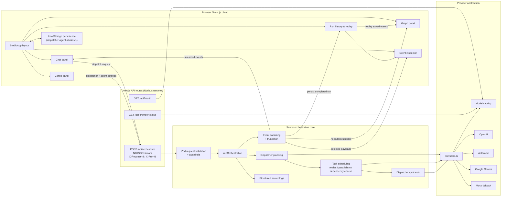

# Dispatcher Agent Studio

A TypeScript web app for **dispatcher-led multi-agent LLM orchestration**. The first model acts as the dispatcher, splits the user request into specialist tasks, routes them to worker agents, collects the reports, and synthesizes the final answer.

## What it includes

- **Chat-first workflow**: the user talks to the dispatcher through a web UI
- **Provider/model configuration**: each agent can use a different provider and model
- **Agent capability editor**: every worker declares its role, specialty, prompt, and visual identity
- **Graph visualization**: see which node is doing what, plus task routing between dispatcher and workers
- **Input/output inspector**: inspect each node's latest prompt, output, and event trail
- **Responsive and accessible UI**: keyboard-friendly panel navigation, visible focus states, and layouts that stay readable on mobile and desktop
- **Mock fallback**: if a provider API key is missing, the run falls back to a mock provider and surfaces a visible warning

## Stack

- Next.js 16
- React 19
- TypeScript
- Tailwind CSS 4
- Vercel AI SDK
- React Flow (`@xyflow/react`)
- Zod

## Deployment target

The primary production target is **Vercel**.

Runtime assumptions for production:

- API routes run on the **Node.js runtime**
- `/api/orchestrate` uses a **60-second max duration** budget
- The app is otherwise **stateless on the server**; studio state and run history persist in the browser
- Live provider keys are optional per provider because the app can fall back to the mock provider for local demos and controlled degraded operation

## Environment variables

Copy the example file and fill in whichever providers you want to use:

```bash
cp .env.example .env.local
```

```env
OPENAI_API_KEY=
ANTHROPIC_API_KEY=
GOOGLE_GENERATIVE_AI_API_KEY=
LOG_LEVEL=info
```

You can leave keys empty while iterating on the UI. The app will explicitly warn and use the mock provider for that node.

| Variable | Required | Purpose |
| --- | --- | --- |
| `OPENAI_API_KEY` | No | Enables OpenAI models selected in the dispatcher or worker config |
| `ANTHROPIC_API_KEY` | No | Enables Anthropic models selected in the dispatcher or worker config |
| `GOOGLE_GENERATIVE_AI_API_KEY` | No | Enables Google Gemini models selected in the dispatcher or worker config |
| `LOG_LEVEL` | No | Server log threshold for API routes: `debug`, `info`, `warn`, or `error` |

In production, only set keys for the providers you intend to expose. Missing keys do not crash the app; they produce visible provider warnings and route that node through the mock fallback instead.

## Run locally

```bash
npm ci
npm run dev
```

Open [http://localhost:3000](http://localhost:3000).

## Deploy to Vercel

1. Import the GitHub repository into Vercel.
2. Keep the project on the default Next.js framework preset.
3. Set the environment variables you need from the table above.
4. Deploy once to create a preview environment, then promote to production.

For CLI-based deployment:

```bash
npm ci
npx vercel
npx vercel --prod
```

The repo is already set up for the default Vercel + Next.js flow, so no extra server or database provisioning is required.

## Available scripts

```bash
npm run dev
npm run lint
npm run test
npx playwright install chromium
npm run test:e2e
npm run build
npm run start
```

## Architecture overview



The flow is dispatcher-first: the client submits the latest prompt plus saved conversation and agent config, `/api/orchestrate` validates the request, the dispatcher generates a task plan, workers execute in parallel with dependency awareness, and the dispatcher synthesizes the final answer.

The same streamed event log drives the chat transcript, graph state, inspector payloads, and replay/history UI. On the server side, provider selection is resolved per node, missing keys degrade to the mock provider with visible warnings, and request/run identifiers tie browser behavior to server logs and operational diagnostics.

## Event stream schema

`/api/orchestrate` emits NDJSON events with schema version `2` in both the
`schemaVersion` field on every event and the
`X-Orchestration-Event-Schema-Version` response header.

Core event types:

- `run-start`
- `dispatcher-plan`
- `task-assignment`
- `node-status`
- `node-chunk`
- `agent-result`
- `final-response`
- `provider-warning`
- `run-complete`, `run-cancelled`, `run-error`

`node-chunk` preserves the raw chunk plus the aggregated output-so-far so the
UI can render live partial dispatcher and worker responses before the run
finishes.

## Persistence model

Studio state is persisted locally in the browser with a versioned storage record:

- **Autosaved**: current dispatcher config, agent team, conversation, and prompt draft
- **Explicitly saved**: named teams from the agent builder
- **Auto-recorded**: recent completed, cancelled, or failed runs with their messages and event log

The current storage key is `dispatcher-agent-studio:v1`. The persistence layer
uses a top-level `schemaVersion` field and a migration boundary in
`src/lib/studio-persistence.ts`. New versions should migrate older payloads into
the latest shape before the app hydrates client state.

## Run history and replay

Saved runs can be reopened directly from the chat panel without rerunning any
models. When a run is active, the UI now supports:

- browsing the stored run history list
- reopening a saved run into the chat, graph, and inspector
- replaying the event log step by step or with playback controls
- comparing the dispatcher plan, worker reports, and final synthesis side by side

Replay mode is driven entirely from the persisted event log, so the graph and
inspector rebuild from stored events instead of making another API call.

## Automated test coverage

The project now includes:

- Vitest coverage for orchestration, provider fallback, run-history helpers, graph derivation, and the `/api/orchestrate` streaming route
- Playwright end-to-end coverage for the main config/chat/graph workflow
- GitHub Actions checks for lint, test, build, and browser-based end-to-end validation on every push and pull request

## Operations baseline

### Health and readiness endpoints

- `/api/health`: deployment/runtime summary plus provider readiness snapshot
- `/api/provider-status`: provider-specific readiness for the UI and operational checks

Example:

```bash
curl -s http://localhost:3000/api/health
```

### Request tracing and logs

`POST /api/orchestrate` now returns:

- `X-Request-Id`: request correlation id, echoed from the incoming header when provided
- `X-Run-Id`: orchestration run id used for streamed events and server logs

The API emits structured JSON logs for accepted runs, provider fallback warnings, terminal failures, cancellations, and stream closure. This makes it possible to correlate:

1. browser/network errors
2. streamed orchestration events
3. server-side logs

with the same request/run identifiers.

### Secrets, limits, and rollback basics

- Keep provider API keys in Vercel project environment variables only; never hardcode them in the repo.
- Treat `provider-warning`, `provider-rate-limit`, and `provider-auth` events as first-line production diagnostics.
- Keep provider/model timeouts under the route budget so a slow provider fails explicitly instead of hanging until platform timeout.
- Roll back by promoting the previous healthy Vercel deployment; the app has no server-side database migrations, so rollback is operationally simple.
